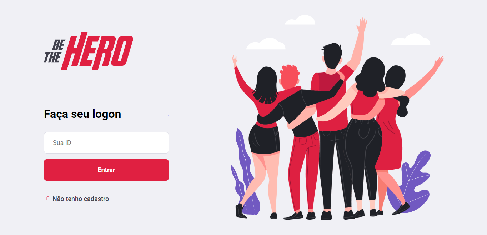
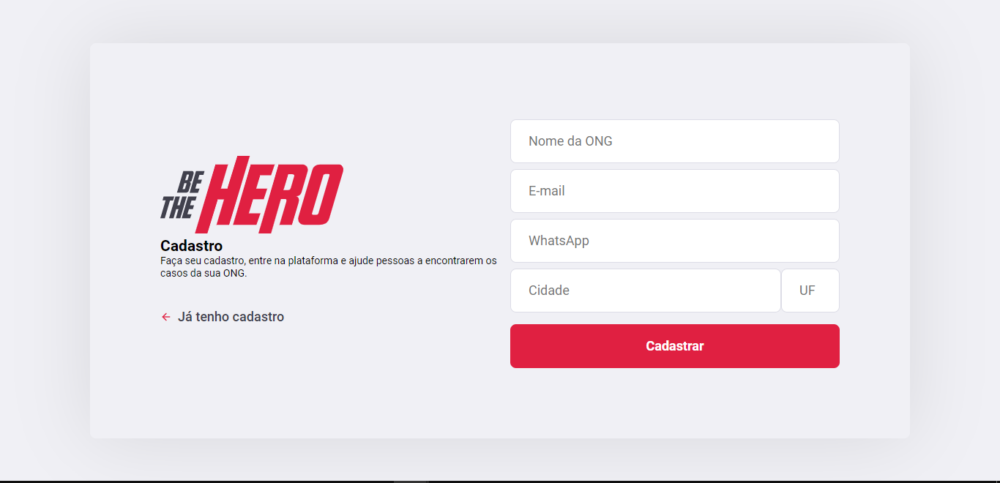
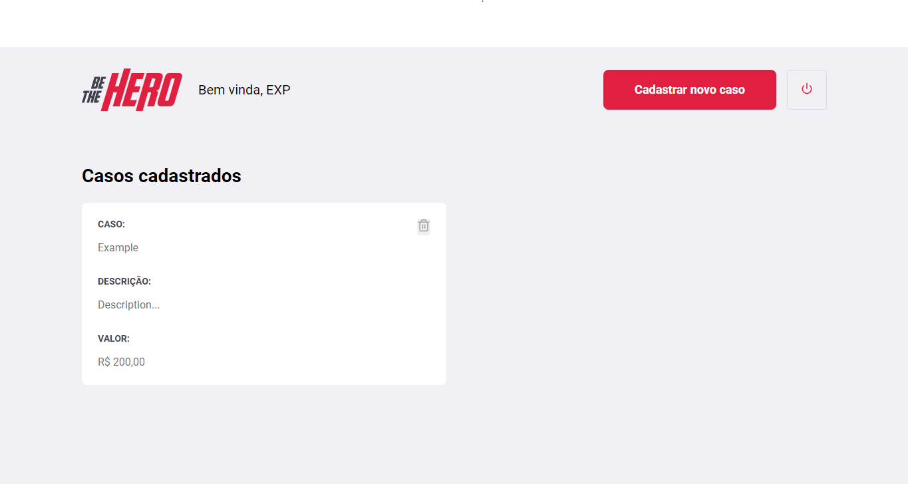
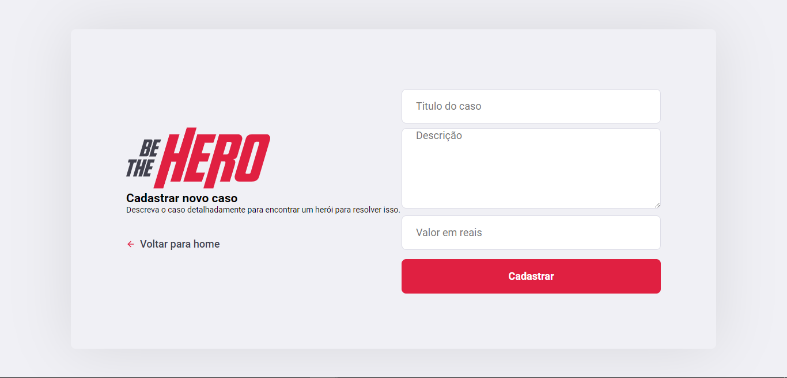
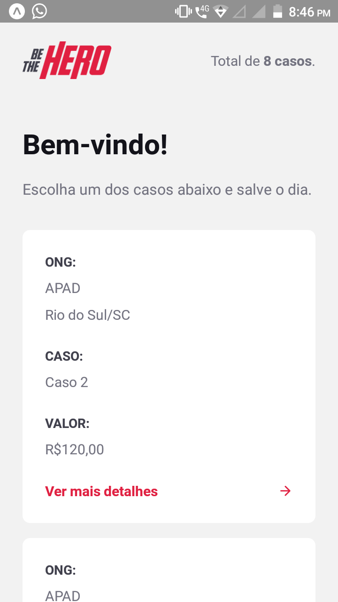
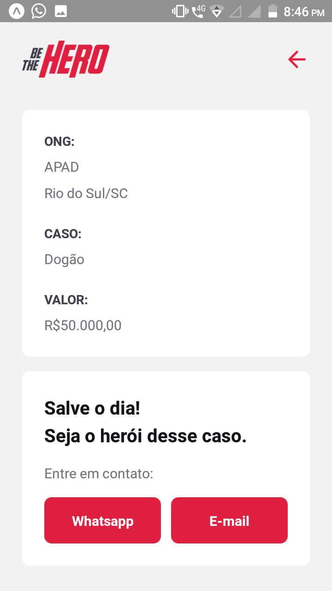

# **Be The Hero**
## About:
> Be the Hero is an application created using Node.js in the server, React to the web and React Native for mobile.
> The application is used to help ONGs (Non Governamental Organizations from Brazil) to collete money with the community to help in it`s cases sollution.
___
## Web Application Screenshots:

### Login 

### Register 

### Cases 

### New case 
___
## Mobile Application Screenshots:  

### Cases   

### Case's info 